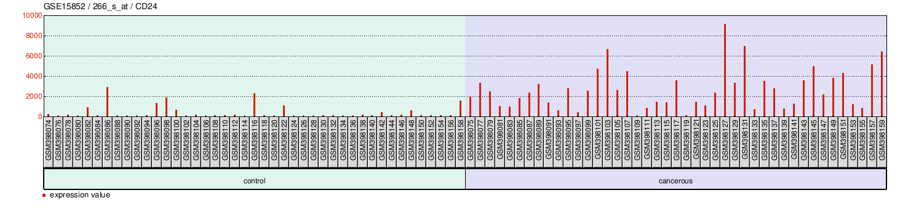

Differential Expression of CD24 in Cancerous and Non-Cancerous Breast
Tissue
================
Paige Bowler
2025-12-06

- [ABSTRACT](#abstract)
- [BACKGROUND](#background)
- [STUDY QUESTIONS AND HYPOTHESIS](#study-questions-and-hypothesis)
  - [QUESTIONS](#questions)
  - [HYPOTHESIS](#hypothesis)
  - [PREDICTIONS](#predictions)
- [METHODS](#methods)
  - [Figure 1: CD24 expression levels](#figure-1-cd24-expression-levels)
  - [Figure 2: Differential Regulation of
    Genes](#figure-2-differential-regulation-of-genes)
- [DISCUSSION](#discussion)
- [WORKS CITED](#works-cited)

# ABSTRACT

Cancer is the result of mutations in multiple genes crucial to cell
cycle regulation. Though it is an incredibly common disease, it is still
not fully understood, due to its multifaceted nature. This analysis
utilizes a dataset of cancerous and non-cancerous breast tissue to
investigate the role of CD24 expression in breast cancer incidence.
Expression levels of CD24 in normal and cancerous tissue were analyzed
in isolation, as well as alongside multiple other genes found to have
significant expression variance between normal and cancerous breast
tissue samples.

# BACKGROUND

Cancer develops when genes that regulate cell replication are damaged,
leading to unregulated proliferation of rogue cells (National Cancer
Institute. 2021). Though cancer rates have been decreasing since the
1990s, it still remains one of the most common causes of death globally
(National Cancer Institute. 2025). Multiple genes must be mutated for a
cell to become cancerous (National Cancer Institute. 2021), butt his
analysis is focused on differential expression of the CD24 gene in
breast cancer.

# STUDY QUESTIONS AND HYPOTHESIS

## QUESTIONS

Is there a relationship between level of expression of C24 and cancer?

## HYPOTHESIS

Level of expression of C24 will differ between cancerous and
non-cancerous tissue.

## PREDICTIONS

C24 will be overexpressed in cancerous tissue.

# METHODS

This analysis pulls data from the \#GSE15852 dataset on the Gene
Expression Omnibus (GEO) database. The dataset consists of 86 breast
tissue samples (43 cancerous, 43 normal) from women in Malaysia. Samples
were sorted into “Control” or “Cancerous” groups. Paired t-tests were
used to compare gene expression between groups (Pau Ni et al. 2010).
P-values were adjusted to avoid false positives using the Bonferroni
multiple test correction. Figure 1 was generated using the GEO2R
software, and the code for figure 2 was generated with the GEO2R
software and modified using ChatGPT.

## Figure 1: CD24 expression levels

``` r

```


Expression level of CD24 in control (non-cancerous) vs cancerous tissue.
CD24 was found to be heavily overexpressed in the samples of cancerous
breast tissue (p = 1.05e-13).

## Figure 2: Differential Regulation of Genes

``` r
# Version info: R 4.2.2, Biobase 2.58.0, GEOquery 2.66.0, limma 3.54.0
################################################################
#   Data plots for selected GEO samples
if (!require("BiocManager", quietly = TRUE))
  install.packages("BiocManager")
```

    ## Bioconductor version '3.18' is out-of-date; the current release version '3.22'
    ##   is available with R version '4.5'; see https://bioconductor.org/install

``` r
BiocManager::install("GEOquery")
```

    ## 'getOption("repos")' replaces Bioconductor standard repositories, see
    ## 'help("repositories", package = "BiocManager")' for details.
    ## Replacement repositories:
    ##     CRAN: http://rspm/default/__linux__/focal/latest

    ## Bioconductor version 3.18 (BiocManager 1.30.26), R 4.3.3 (2024-02-29)

    ## Warning: package(s) not installed when version(s) same as or greater than current; use
    ##   `force = TRUE` to re-install: 'GEOquery'

    ## Installation paths not writeable, unable to update packages
    ##   path: /opt/R/4.3.3/lib/R/library
    ##   packages:
    ##     boot, class, cluster, codetools, foreign, KernSmooth, lattice, nlme, nnet,
    ##     rpart, spatial, survival

    ## Old packages: 'BiocManager', 'digest', 'readr', 'reticulate', 'tinytex', 'xml2'

``` r
library(GEOquery)
```

    ## Loading required package: Biobase

    ## Loading required package: BiocGenerics

    ## 
    ## Attaching package: 'BiocGenerics'

    ## The following objects are masked from 'package:stats':
    ## 
    ##     IQR, mad, sd, var, xtabs

    ## The following objects are masked from 'package:base':
    ## 
    ##     anyDuplicated, aperm, append, as.data.frame, basename, cbind,
    ##     colnames, dirname, do.call, duplicated, eval, evalq, Filter, Find,
    ##     get, grep, grepl, intersect, is.unsorted, lapply, Map, mapply,
    ##     match, mget, order, paste, pmax, pmax.int, pmin, pmin.int,
    ##     Position, rank, rbind, Reduce, rownames, sapply, setdiff, sort,
    ##     table, tapply, union, unique, unsplit, which.max, which.min

    ## Welcome to Bioconductor
    ## 
    ##     Vignettes contain introductory material; view with
    ##     'browseVignettes()'. To cite Bioconductor, see
    ##     'citation("Biobase")', and for packages 'citation("pkgname")'.

    ## Setting options('download.file.method.GEOquery'='auto')

    ## Setting options('GEOquery.inmemory.gpl'=FALSE)

``` r
if (!require("BiocManager", quietly = TRUE))
  install.packages("BiocManager")

BiocManager::install("limma")
```

    ## 'getOption("repos")' replaces Bioconductor standard repositories, see
    ## 'help("repositories", package = "BiocManager")' for details.
    ## Replacement repositories:
    ##     CRAN: http://rspm/default/__linux__/focal/latest

    ## Bioconductor version 3.18 (BiocManager 1.30.26), R 4.3.3 (2024-02-29)

    ## Warning: package(s) not installed when version(s) same as or greater than current; use
    ##   `force = TRUE` to re-install: 'limma'

    ## Installation paths not writeable, unable to update packages
    ##   path: /opt/R/4.3.3/lib/R/library
    ##   packages:
    ##     boot, class, cluster, codetools, foreign, KernSmooth, lattice, nlme, nnet,
    ##     rpart, spatial, survival

    ## Old packages: 'BiocManager', 'digest', 'readr', 'reticulate', 'tinytex', 'xml2'

``` r
library(limma)
```

    ## 
    ## Attaching package: 'limma'

    ## The following object is masked from 'package:BiocGenerics':
    ## 
    ##     plotMA

``` r
install.packages("umap")
```

    ## Installing package into '/cloud/lib/x86_64-pc-linux-gnu-library/4.3'
    ## (as 'lib' is unspecified)

``` r
library(umap)

# Version info: R 4.2.2, Biobase 2.58.0, GEOquery 2.66.0, limma 3.54.0
################################################################
#   Differential expression analysis with limma
library(GEOquery)
library(limma)
library(umap)

# load series and platform data from GEO

gset <- getGEO("GSE15852", GSEMatrix =TRUE, AnnotGPL=TRUE)
```

    ## Found 1 file(s)

    ## GSE15852_series_matrix.txt.gz

``` r
if (length(gset) > 1) idx <- grep("GPL96", attr(gset, "names")) else idx <- 1
gset <- gset[[idx]]

# make proper column names to match toptable 
fvarLabels(gset) <- make.names(fvarLabels(gset))

# group membership for all samples
gsms <- paste0("01010101010101010101010101010101010101010101010101",
               "010101010101010101010101010101010101")
sml <- strsplit(gsms, split="")[[1]]

# log2 transformation
ex <- exprs(gset)
qx <- as.numeric(quantile(ex, c(0., 0.25, 0.5, 0.75, 0.99, 1.0), na.rm=T))
LogC <- (qx[5] > 100) ||
  (qx[6]-qx[1] > 50 && qx[2] > 0)
if (LogC) { ex[which(ex <= 0)] <- NaN
exprs(gset) <- log2(ex) }

# assign samples to groups and set up design matrix
gs <- factor(sml)
groups <- make.names(c("Normal Breast Tissue","Tumor Breast Tissue"))
levels(gs) <- groups
gset$group <- gs
design <- model.matrix(~group + 0, gset)
colnames(design) <- levels(gs)

gset <- gset[complete.cases(exprs(gset)), ] # skip missing values

fit <- lmFit(gset, design)  # fit linear model

# set up contrasts of interest and recalculate model coefficients
cts <- paste(groups[1], groups[2], sep="-")
cont.matrix <- makeContrasts(contrasts=cts, levels=design)
fit2 <- contrasts.fit(fit, cont.matrix)

# compute statistics and table of top significant genes
fit2 <- eBayes(fit2, 0.01)
tT <- topTable(fit2, adjust="fdr", sort.by="B", number=250)

tT <- subset(tT, select=c("ID","adj.P.Val","P.Value","t","B","logFC","Gene.symbol","Gene.title","Gene.ID"))

# Visualize and quality control test results.
# Build histogram of P-values for all genes. Normal test
# assumption is that most genes are not differentially expressed.
tT2 <- topTable(fit2, adjust="fdr", sort.by="B", number=Inf)

# summarize test results as "up", "down" or "not expressed"
dT <- decideTests(fit2, adjust.method="bonferroni", p.value=0.05, lfc=0)

# Volcano plot (log P-value vs log fold change)
colnames(fit2) # list contrast names
```

    ## [1] "Normal.Breast.Tissue-Tumor.Breast.Tissue"

``` r
ct <- 1  # choose contrast of interest
dT <- topTable(fit2, coef = ct, number = Inf, adjust.method = "BH")

# Define thresholds
logFC_cutoff <- 1
adjP_cutoff <- 0.05

# Assign colors based on thresholds
dT$color <- "grey"  # default
dT$color[dT$logFC >  logFC_cutoff & dT$adj.P.Val < adjP_cutoff] <- "red"    # upregulated
dT$color[dT$logFC < -logFC_cutoff & dT$adj.P.Val < adjP_cutoff] <- "blue"   # downregulated

# Clean up the contrast name (remove periods)
contrast_name <- gsub("\\.", " ", colnames(fit2)[ct])
contrast_name <- gsub("-", " and ", contrast_name)

# Draw volcano plot
with(dT, plot(logFC, -log10(adj.P.Val),
              pch = 20,
              col = color,
              main = paste("GSE15852:", contrast_name),
              xlab = "log2 Fold Change",
              ylab = "-log10 Adjusted P-value"))

# Add legend
legend("bottomleft",
       legend = c("Upregulated", "Downregulated", "Not significant"),
       col = c("red", "blue", "grey"),
       pch = 20,
       bty = "n")
```

<!-- -->

Volcano plot of genes over- or underexpressed in cancerous breast
tissue. Abnormal expression is significantly associated with cancerous
breast tissue for multiple genes.

# DISCUSSION

As seen in figure 1, high levels of CD24 expression are significantly
associated with breast cancer.There does appear to be a relationship
between CD24 overexpression and breast cancer incidence, but it is
difficult to ascertain the exact relationship between the two. Cancer is
a complex disease that requires multiple mutated genes to occur
(National Cancer Institute. 2021), and as seen in figure 2, this data
set is certainly not an exception. Overexpression of CD24 was also seen
in non-cancerous breast tissue samples, also indicating that it is not
the only determining factor in whether or not cancer develops.Further
research will hopefully shed more light on CD24’s role in breast cancer.

# WORKS CITED

ChatGPT. OpenAI, version Nov 2025. Used to modify color, legend, and
title of the volcano plot. Accessed Nov 11, 2025.

National Cancer Institute. (2021, October 11). What is cancer? In
Understanding Cancer. U.S. Department of Health and Human Services.
<https://www.cancer.gov/about-cancer/understanding/what-is-cancer>

National Cancer Institute. (2025, May 7). Cancer Statistics In
Understanding Cancer. U.S. Department of Health and Human Services.
<https://www.cancer.gov/about-cancer/understanding/statistics>

Pau Ni IB, Zakaria Z, Muhammad R, Abdullah N et al. Gene expression
patterns distinguish breast carcinomas from normal bre ast tissues: the
Malaysian context. Pathol Res Pract 2010 Apr 15;206(4):223-8. PMID:
20097481
