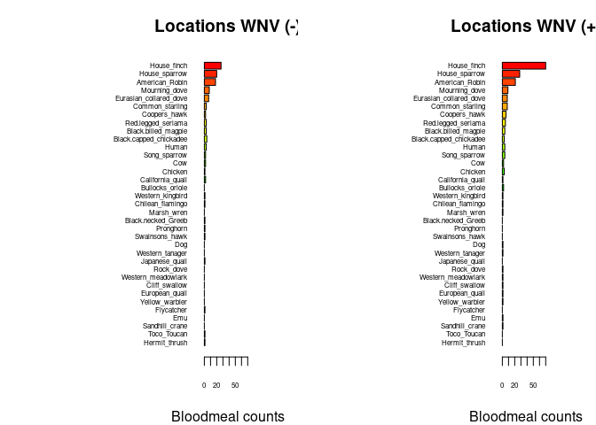

Warm-up mini-Report: Mosquito Blood Hosts in Salt Lake City, Utah
================
Paige Bowler
2025-11-04

- [ABSTRACT](#abstract)
- [BACKGROUND](#background)
- [STUDY QUESTION and HYPOTHESIS](#study-question-and-hypothesis)
  - [Questions](#questions)
  - [Hypothesis](#hypothesis)
  - [Prediction](#prediction)
- [METHODS](#methods)
  - [Analysis \#1 - Barplot of Bloodmeals by
    Species](#analysis-1---barplot-of-bloodmeals-by-species)
  - [Analysis \#2 - Generalized Linear
    Model](#analysis-2---generalized-linear-model)
- [DISCUSSION](#discussion)
  - [Interpretation of 1st analysis](#interpretation-of-1st-analysis)
  - [Interpretation of 2nd analysis](#interpretation-of-2nd-analysis)
- [CONCLUSION](#conclusion)
- [REFERENCES](#references)

# ABSTRACT

    West Nile Virus (WNV) is commonly transmitted to humans and other
mammals by mosquitoes, who pick it up when they feed on infected birds.
Understanding which species of birds amplify WNV the most may be
incredibly helpful in tracking and controlling the spread of the virus.
This report investigates the relationship between house finch bloodmeals
and the prevalence of WNV at multiple sites within Salt Lake City using
multiple methods of analysis. Ultimately, it was determined that there
is a positive relationship between the number of house finch bloodmeals
and whether or not a site was WNV+.

# BACKGROUND

   Mosquitos pick up West Nile Virus (WNV) when they feed on infected
birds, which they then transmit to humans and other mammals. Bloodfed
mosquitos can be collected and DNA extracted. The resultant DNA extract
contains both the mosquito and its meal’s DNA- the latter of which can
be isolated and replicated through PCR by using vertebrate-specific
primers, sequenced, and used to assemble a profile of potential hosts
and amplifiers of WNV.  
    The length of time that WMV viremia remains detectible (and thus
transmissible) varies from species to species of bird (Komar et
al. 2003). Birds that maintain viremia in their blood for longer may be
responsible for more WNV+ mosquitos, and ultimately cause a greater
number of mammal infections. House finches maintain detectible viremia
for a notably lengthy duration. This, coupled with their prevalence in
more densely populated areas, like Salt Lake, may make them a
significant vector for the amplification of the spread of WNV.

``` r
# Manually transcribe duration (mean, lo, hi) from the last table column
duration <- data.frame(
  Bird = c("Canada Goose","Mallard", 
           "American Kestrel","Northern Bobwhite",
           "Japanese Quail","Ring-necked Pheasant",
           "American Coot","Killdeer",
           "Ring-billed Gull","Mourning Dove",
           "Rock Dove","Monk Parakeet",
           "Budgerigar","Great Horned Owl",
           "Northern Flicker","Blue Jay",
           "Black-billed Magpie","American Crow",
           "Fish Crow","American Robin",
           "European Starling","Red-winged Blackbird",
           "Common Grackle","House Finch","House Sparrow"),
  mean = c(4.0,4.0,4.5,4.0,1.3,3.7,4.0,4.5,5.5,3.7,3.2,2.7,1.7,6.0,4.0,
           4.0,5.0,3.8,5.0,4.5,3.2,3.0,3.3,6.0,4.5),
  lo   = c(3,4,4,3,0,3,4,4,4,3,3,1,0,6,3,
           3,5,3,4,4,3,3,3,5,2),
  hi   = c(5,4,5,5,4,4,4,5,7,4,4,4,4,6,5,
           5,5,5,7,5,4,3,4,7,6)
)

# Choose some colors
cols <- c(rainbow(30)[c(10:29,1:5)])  # rainbow colors

# horizontal barplot
par(mar=c(5,12,2,2))  # wider left margin for names
bp <- barplot(duration$mean, horiz=TRUE, names.arg=duration$Bird,
              las=1, col=cols, xlab="Days of detectable viremia", xlim=c(0,7))

# add error bars
arrows(duration$lo, bp, duration$hi, bp,
       angle=90, code=3, length=0.05, col="black", xpd=TRUE)
```


# STUDY QUESTION and HYPOTHESIS

## Questions

What bird species significantly amplifies the spread of WNV in Salt Lake
City?

## Hypothesis

House finches are key to spread of WNV.

## Prediction

House finch bloodmeals will be positively correlated with the frequency
of WNV+ mosquito pools.

# METHODS

   Bar plots were generated to display the number of bloodmeals per
species for WNV+ and WNV- areas. This allows for the visualization of
patterns and differences between WNV+/- locations.  
   Additionally, two generalized linear models were run to investigate
the relationship between house finch bloodmeals and both WMV+ pools and
positivity rates. These models provide a more in-depth, quantitative
breakdown of data than bar plots can provide, and can determine if the
relationships the plots show are statistically significant.

## Analysis \#1 - Barplot of Bloodmeals by Species

   Number of bloodmeals taken per host species from locations where no
WNV+ pools (-) and sites with 1+ WNV+ pools (+). These bar plots provide
visual representation of the data, making differences in number of
feedings per species between WNV+ and WNV- sites easier to see.

``` r
## import counts_matrix: data.frame with column 'loc_positives' (0/1) and host columns 'host_*'
counts_matrix <- read.csv("./bloodmeal_plusWNV_for_BIOL3070.csv")

## 1) Identify host columns
host_cols <- grep("^host_", names(counts_matrix), value = TRUE)

if (length(host_cols) == 0) {
  stop("No columns matching '^host_' were found in counts_matrix.")
}

## 2) Ensure loc_positives is present and has both levels 0 and 1 where possible
counts_matrix$loc_positives <- factor(counts_matrix$loc_positives, levels = c(0, 1))

## 3) Aggregate host counts by loc_positives
agg <- stats::aggregate(
  counts_matrix[, host_cols, drop = FALSE],
  by = list(loc_positives = counts_matrix$loc_positives),
  FUN = function(x) sum(as.numeric(x), na.rm = TRUE)
)

## make sure both rows exist; if one is missing, add a zero row
need_levels <- setdiff(levels(counts_matrix$loc_positives), as.character(agg$loc_positives))
if (length(need_levels)) {
  zero_row <- as.list(rep(0, length(host_cols)))
  names(zero_row) <- host_cols
  for (lv in need_levels) {
    agg <- rbind(agg, c(lv, zero_row))
  }
  ## restore proper type
  agg$loc_positives <- factor(agg$loc_positives, levels = c("0","1"))
  ## coerce numeric host cols (they may have become character after rbind)
  for (hc in host_cols) agg[[hc]] <- as.numeric(agg[[hc]])
  agg <- agg[order(agg$loc_positives), , drop = FALSE]
}

## 4) Decide species order (overall abundance, descending)
overall <- colSums(agg[, host_cols, drop = FALSE], na.rm = TRUE)
host_order <- names(sort(overall, decreasing = TRUE))
species_labels <- rev(sub("^host_", "", host_order))  # nicer labels

## 5) Build count vectors for each panel in the SAME order
counts0 <- rev(as.numeric(agg[agg$loc_positives == 0, host_order, drop = TRUE]))
counts1 <- rev(as.numeric(agg[agg$loc_positives == 1, host_order, drop = TRUE]))

## 6) Colors: reuse your existing 'cols' if it exists and is long enough; otherwise generate
if (exists("cols") && length(cols) >= length(host_order)) {
  species_colors <- setNames(cols[seq_along(host_order)], species_labels)
} else {
  species_colors <- setNames(rainbow(length(host_order) + 10)[seq_along(host_order)], species_labels)
}

## 7) Shared x-limit for comparability
xmax <- max(c(counts0, counts1), na.rm = TRUE)
xmax <- if (is.finite(xmax)) xmax else 1
xlim_use <- c(0, xmax * 1.08)

## 8) Plot: two horizontal barplots with identical order and colors
op <- par(mfrow = c(1, 2),
          mar = c(4, 12, 3,2.75),# big left margin for species names
          xaxs = "i")           # a bit tighter axis padding

## Panel A: No WNV detected (loc_positives = 0)
barplot(height = counts0,
        names.arg = species_labels, 
        cex.names = .5,
        cex.axis = .5,
        col = rev(unname(species_colors[species_labels])),
        horiz = TRUE,
        las = 1,
        xlab = "Bloodmeal counts",
        main = "Locations WNV (-)",
        xlim = xlim_use)

## Panel B: WNV detected (loc_positives = 1)
barplot(height = counts1,
        names.arg = species_labels, 
        cex.names = .5,
        cex.axis = .5,
        col = rev(unname(species_colors[species_labels])),
        horiz = TRUE,
        las = 1,
        xlab = "Bloodmeal counts",
        main = "Locations WNV (+)",
        xlim = xlim_use)
```

<!-- -->

``` r
par(op)

## Keep the colors mapping for reuse elsewhere
host_species_colors <- species_colors
```

## Analysis \#2 - Generalized Linear Model

    This analysis uses two generalized linear models to determine the
relationship between finch bloodmeals and the presence of WNV+ pools
using binary data, and between finch bloodmeals and and WNV positivity
rate using numeric data, as well as the statistical significance of
both. The data from this analysis may support the patterns shown in
analysis \#1.

``` r
# second-analysis-or-plot, glm with house finch alone against binary +/_
glm1 <- glm(loc_positives ~ host_House_finch,
            data = counts_matrix,
            family = binomial)
summary(glm1)
```

    ## 
    ## Call:
    ## glm(formula = loc_positives ~ host_House_finch, family = binomial, 
    ##     data = counts_matrix)
    ## 
    ## Coefficients:
    ##                  Estimate Std. Error z value Pr(>|z|)  
    ## (Intercept)       -0.1709     0.1053  -1.622   0.1047  
    ## host_House_finch   0.3468     0.1586   2.187   0.0287 *
    ## ---
    ## Signif. codes:  0 '***' 0.001 '**' 0.01 '*' 0.05 '.' 0.1 ' ' 1
    ## 
    ## (Dispersion parameter for binomial family taken to be 1)
    ## 
    ##     Null deviance: 546.67  on 394  degrees of freedom
    ## Residual deviance: 539.69  on 393  degrees of freedom
    ## AIC: 543.69
    ## 
    ## Number of Fisher Scoring iterations: 4

``` r
#glm with house-finch alone against positivity rate
glm2 <- glm(loc_rate ~ host_House_finch,
            data = counts_matrix)
summary(glm2)
```

    ## 
    ## Call:
    ## glm(formula = loc_rate ~ host_House_finch, data = counts_matrix)
    ## 
    ## Coefficients:
    ##                  Estimate Std. Error t value Pr(>|t|)    
    ## (Intercept)      0.054861   0.006755   8.122 6.07e-15 ***
    ## host_House_finch 0.027479   0.006662   4.125 4.54e-05 ***
    ## ---
    ## Signif. codes:  0 '***' 0.001 '**' 0.01 '*' 0.05 '.' 0.1 ' ' 1
    ## 
    ## (Dispersion parameter for gaussian family taken to be 0.01689032)
    ## 
    ##     Null deviance: 6.8915  on 392  degrees of freedom
    ## Residual deviance: 6.6041  on 391  degrees of freedom
    ##   (2 observations deleted due to missingness)
    ## AIC: -484.56
    ## 
    ## Number of Fisher Scoring iterations: 2

# DISCUSSION

  The barplot in analysis \#1 indicates that the number of house finch
blood meals is noticeably greater in WNV+ sites than WNV- sites.  
   Analysis \#2 supports the results of analysis \#1, with a
statistically significant positive correlation between the number of
house finch bloodmeals and the WNV positivity of a site. It also shows
that there is a very small, but very significant positive correlation
between the number of house finch blood meals at a site and its degree
of WNV positivity.

## Interpretation of 1st analysis

    Analysis \#1 looked at the number of bloodmeals per host species in
WNV+ sites and WNV- sites. It showed that ~30 more house finch
bloodmeals occured at positive sites than negative, though it cannot be
determined that there is a significant difference between the two by bar
plot alone.

## Interpretation of 2nd analysis

   Analysis \#2 showed a positive correlation (0.3468) between number of
house finch bloodmeals and whether or not a site was WNV positive or
negative. This relationship is statistically significant (p = 0.0287),
and supports the the pattern observed in analysis \#1. Analysis \#2 also
showed a small, but positive positive correlation (0.027479.) between
number of house finch bloodmeals and the degree of WNV positivity of a
site. Though small, this relationship is incredibly significant (p =
4.54e-05).

# CONCLUSION

    Based on the analyses run, it can be determined that house finches
are heavily responsible for the amplification of WNV in Salt Lake City.

# REFERENCES

1.  Komar N, Langevin S, Hinten S, Nemeth N, Edwards E, Hettler D, Davis
    B, Bowen R, Bunning M. Experimental infection of North American
    birds with the New York 1999 strain of West Nile virus. Emerg Infect
    Dis. 2003 Mar;9(3):311-22. <https://doi.org/10.3201/eid0903.020628>

2.  ChatGPT. OpenAI, version Jan 2025. Used as a reference for functions
    such as plot() and to correct syntax errors. Accessed 2025-11-04.
